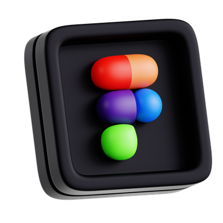

<p align="center">
  
</p>

<h1 align="center">Personal Portfolio</h1>

<p align="center">
  🖥️ <strong>A clean, modern portfolio built with HTML, CSS and JavaScript.</strong>
</p>

<!-- tech stack icons -->
<p align="center">
   &nbsp;
   &nbsp;
   &nbsp;
   &nbsp;
  
</p>

<p align="center">
  <a href="https://kishan-y.github.io/Personal_Portfolio/">
    
  </a>
  <a href="https://github.com/KISHAN-Y/Personal_Portfolio/archive/refs/heads/main.zip">
    
  </a>
</p>

---

## 🚀 About this project  

Simple, responsive personal portfolio showcasing projects, skills and contact details.  
Built as a single-page static site so deployment is instant — drop it into GitHub Pages or any static host.

---

## ✨ Highlights  

<table align="center" style="width:100%; border: none;">
  <tr>
    <td align="center" width="25%" style="padding: 20px;">
      <br>
      <h4><strong>Responsive Layout</strong></h4>
      <p style="text-align: justify;">
        <em>Looks great and functions perfectly on phones, tablets, and desktops.</em>
      </p>
    </td>
    <td align="center" width="25%" style="padding: 20px;">
      <br>
      <h4><strong>Organized Code</strong></h4>
      <p style="text-align: justify;">
        <em>Readable HTML, well-structured CSS, and modular JavaScript for easy maintenance.</em>
      </p>
    </td>
    <td align="center" width="25%" style="padding: 20px;">
      <br>
      <h4><strong>GSAP Animations</strong></h4>
      <p style="text-align: justify;">
        <em>Smooth, high-performance animations powered by the GSAP library.</em>
      </p>
    </td>
    <td align="center" width="25%" style="padding: 20px;">
      <br>
      <h4><strong>Interactive UI</strong></h4>
      <p style="text-align: justify;">
        <em>Engaging scroll-triggered animations that bring the content to life.</em>
      </p>
    </td>
  </tr>
</table>

---

## 📂 Quick start  

```bash
git clone https://github.com/KISHAN-Y/Personal_Portfolio.git
cd Personal_Portfolio
# open index.html in your browser or run a local server
